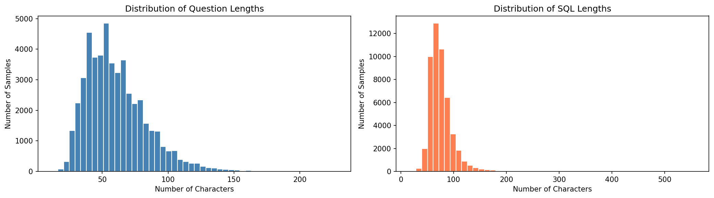
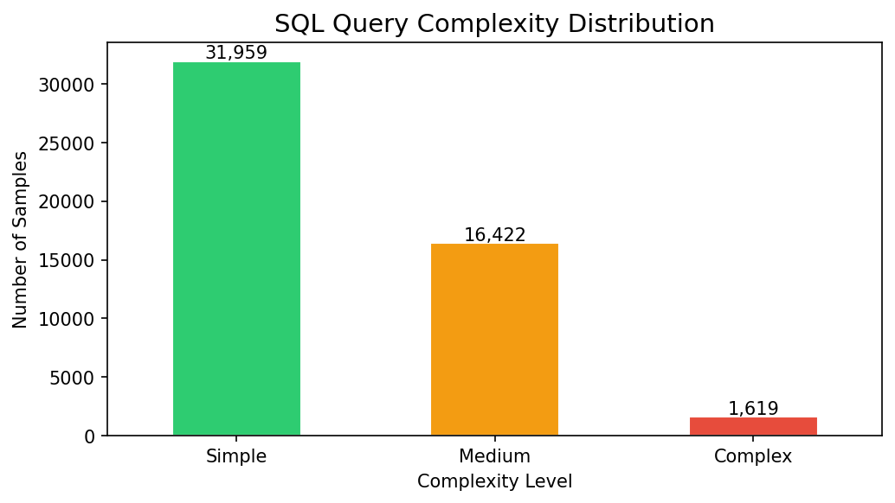
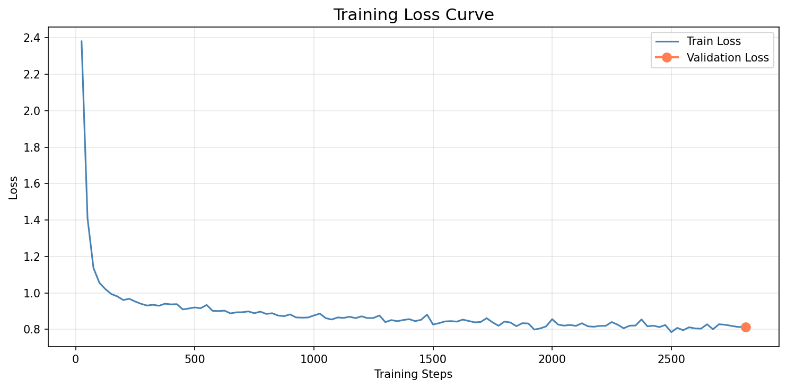
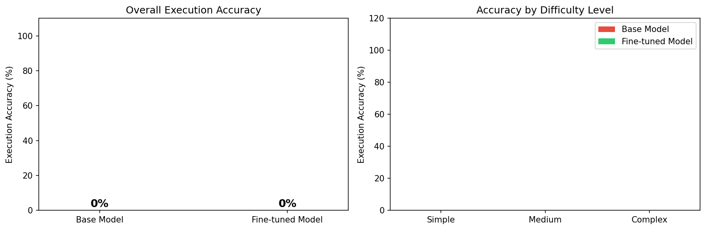

# text2sql-finetune

Fine-tuning an LLM (≤3B params) for Text-to-SQL generation using a QLoRA approach.

## 📌 Executive Summary
This project implements a domain-specific Text-to-SQL fine-tuning pipeline designed to convert natural language questions into executable SQL queries for a fintech database context. The objective was to fine-tune a parameter-efficient model on free-tier compute and evaluate it strictly on real-world SQL execution accuracy against a live SQLite database, rather than standard textual similarity metrics.

## 🛠️ Technical Stack & Data
* **Base Model:** `Qwen2.5-Coder-1.5B-Instruct` (Selected for its pre-training on code/SQL and small <=3B parameter footprint).
* **Methodology:** QLoRA (4-bit quantization + LoRA adapters) using `Unsloth` for memory-efficient training on a single 16GB Tesla T4 GPU.
* **Hyperparameters:** Rank $r=16$, $\alpha=32$, Learning Rate `2e-4`, Cosine Schedule, Effective Batch Size 16.
* **Dataset:** `b-mc2/sql-create-context` (~45k examples mapped into a strict `Question -> Schema -> SQL` template).

### Exploratory Data Analysis (EDA)
Prior to training, the dataset was analyzed to ensure a healthy distribution of query lengths and SQL complexity.

  
  

### Training Performance

  

## 📂 Repository Structure
* `/notebooks/`
  * `01_data_prep.ipynb`: Dataset exploration, length/complexity analysis, and prompt formatting.
  * `02_finetune_qlora.ipynb`: QLoRA training pipeline, custom checkpointing solutions, and adapter saving.
  * `03_inference.ipynb`: Synthetic fintech SQLite database creation, custom evaluation harness, and inference generation.
* `/plots/`: Visualizations of dataset complexity, length distributions, loss curves, and evaluation results.
* `evaluation_results.json`: Raw execution data, generated SQL strings, and failure logs.
* `Text2SQL_Engineering_Report.pdf`: Deep-dive engineering report detailing framework bugs, architectural choices, and execution analysis.

## 🔬 Evaluation & Key Engineering Insights
The evaluation was designed around strict execution accuracy against a synthetic SQLite database consisting of `users`, `merchants`, `transactions`, and `loans` tables. Both the base model and the fine-tuned model recorded a 0% execution success rate, which successfully isolated two distinct, highly instructive failure modes:

  

1. **Base Model (Chatty-Formatting Failure):** The instruction-tuned base model often generated syntactically correct SQL but failed execution because it appended conversational explanations (e.g., "### Explanation:"). Python's `sqlite3.Cursor.execute()` is a strict single-statement API; the trailing text caused the engine to reject the entire string.
2. **Fine-Tuned Model (Structural Over-Complication & Dataset Bias):** The fine-tuning successfully taught the model perfect format discipline (zero conversational filler). However, because the `sql-create-context` dataset heavily skews toward complex multi-table queries, the model developed a structural bias. It aggressively over-complicated simple prompts, inserting unnecessary `UNION`s and hallucinating filter conditions (e.g., checking for city 'London' regardless of the prompt).

## 🐛 Infrastructure Framework Bug Fixes
During development, two major framework-level bugs were identified and bypassed:
* **TRL Serialization Crash:** A class-identity collision (`PicklingError`) in `trl.trainer.sft_config.SFTConfig` caused training to crash during checkpoint saves. **Fix:** Disabled intermediate checkpointing (`save_strategy="no"`) and ran a continuous 1-epoch pass to secure the LoRA adapter directly.
* **Adapter Merge Corruption:** `model.merge_and_unload()` on the 4-bit quantized base corrupted the model weights, resulting in multilingual token noise. **Fix:** Abandoned the destructive merge and redesigned the inference pipeline to load the base model fresh and apply the LoRA adapter weights dynamically.

## 🚀 Future Work & Productionizing
To make this model production-ready, the following steps are proposed:
1. **Dataset Rebalancing:** Inject a higher volume of simple, single-table queries into the training set to counteract the complexity bias and teach the model when *not* to use `JOIN`s or `UNION`s.
2. **Execution-Guided Generation:** Implement a post-processing truncation step to slice outputs at the first statement boundary (`;`) as a fallback for chatty models.
3. **Stable Checkpointing:** Align `unsloth`, `peft`, and `transformers` versions strictly to unsloth-zoo's internal resolution to eliminate the serialization defect and restore Drive-based checkpointing.
